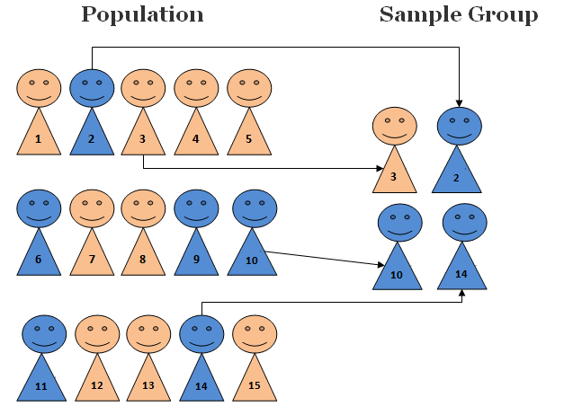
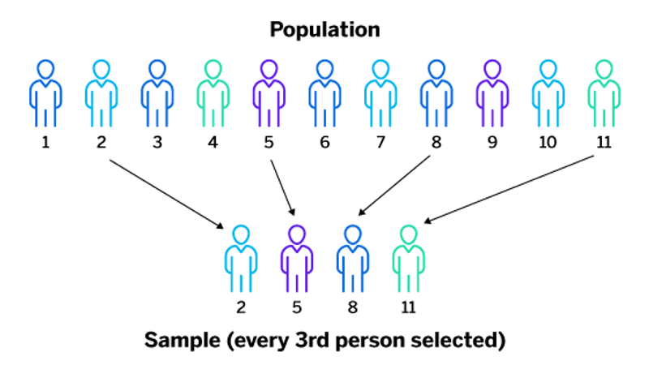
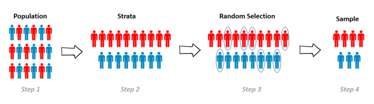
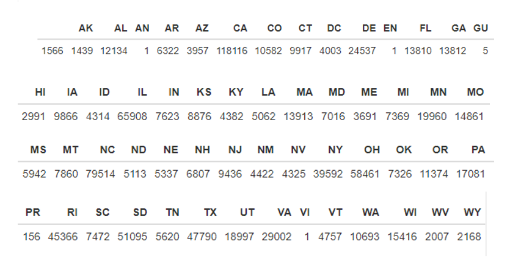
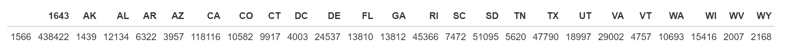
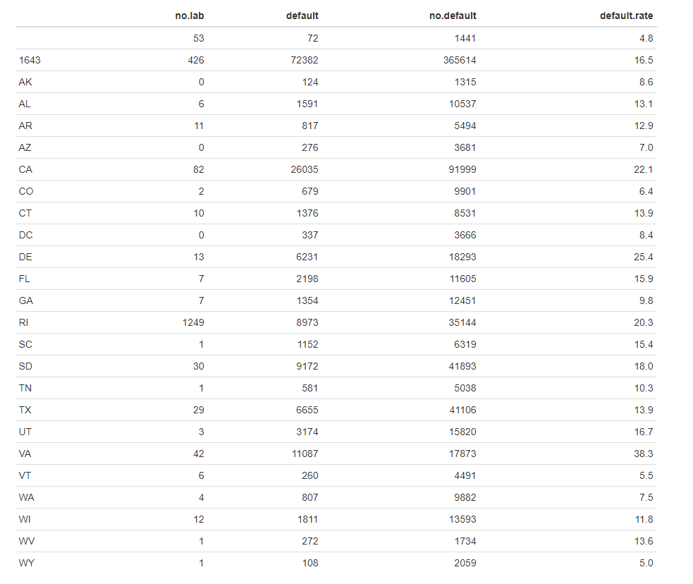
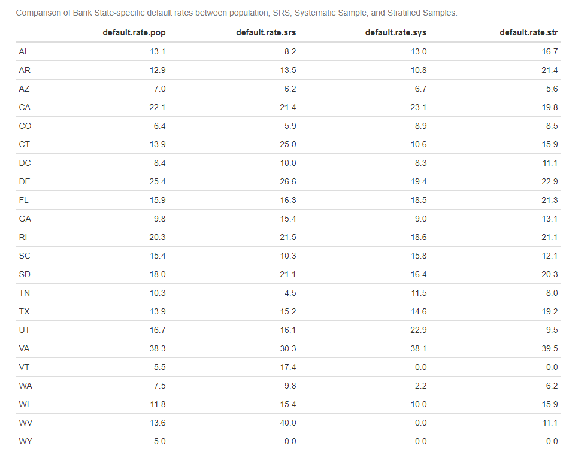
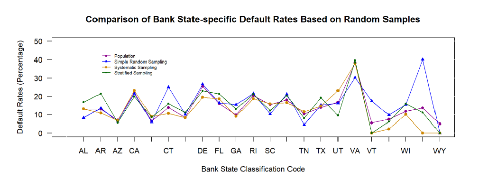
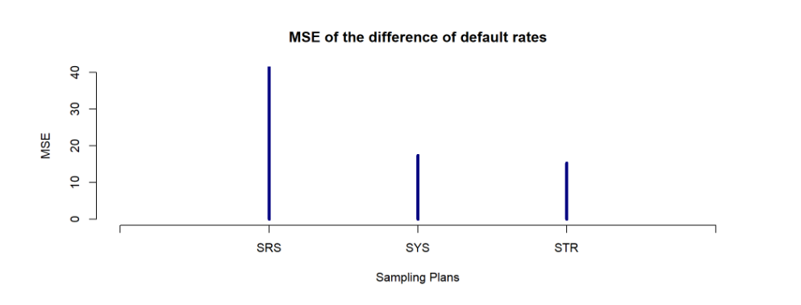

```{r setup, include=FALSE}
options(htmltools.dir.version = FALSE)
##
if(!require('xaringan')) {
  remotes::install_github("yihui/xaringan")
  library('xaringan')
}
if (!require("knitr")) {
   install.packages("knitr")
   library(knitr)
}
if (!require("leaflet")) {
   install.packages("leaflet")
   library(leaflet)
}
if (!require("ggplot2")) {
    install.packages("ggplot2")
    library(ggplot2)
}
if (!require("dplyr")) {
    install.packages("dplyr")
    library(dplyr)
}
if (!require("broom")) {
    install.packages("broom")
    library(broom)
}
if (!require("ggpubr")) {
    install.packages("ggpubr")
    library(ggpubr)
}
# remotes::install_github("yihui/xaringan")
```

## <center>Presentation Overview </center>

<center>•	Data Description </center>

<center>•	Simple Random Sampling (SRS) </center>

<center>•	Systematic Sampling (SYS) </center>

<center>•	Stratified Sampling (STR) </center>

<center>•	Stratification Variable </center>

<center>•	Study Population </center>

<center>•	Performance Analysis of Random Samples </center>

<center>•	Conclusion </center>
```{r echo = FALSE, fig.align='center', out.width = '55%'}

```
---
class: middle

## <center>Data Description</center>
The data set is from the U.S. Small Business Administration (SBA) and provides historical data from 1987 through 2014. This large data set contains 27 variables and 899,164 observations.
```{r echo = FALSE, fig.align='center', out.width = '55%'}

```

---
class: middle
## <center>Simple Random Sampling </center>
A simple random sample takes a small, random portion of the entire population to represent the entire data set, where each member has an equal probability of being chosen.

```{r echo = FALSE, fig.align='center', out.width = '55%'}

```
---
class: middle
## <center>Systematic Sampling </center>
Systematic sampling is a probability sampling method in which a random sample, with a fixed periodic interval (jump size), is selected from a larger population. Since our population size is 694,216, and we are selecting 4000 random samples from the population, the jump size is calculated by m=694216/4000=173.55. The actual jump size is 173.
```{r echo = FALSE, fig.align='center', out.width = '55%'}

```

---
class: middle
## <center>Stratified Sampling and Stratification Variable </center>
Stratified sampling involves the division of a population into smaller subgroups known as strata. In stratified, the strata are formed based on members’ shared attributes or characteristics, such as income or educational attainment. The shared attribute or characteristic is known as the stratification variable.

For my stratification variable, I choose the term BankState.

```{r echo = FALSE, fig.align='center', out.width = '55%'}

```

---
## <center>Study Population </center>
```{r echo = FALSE, fig.align='center', out.width = '65%'}

```

Here I combined the bank states from HI to PA. Then I excluded small-size categories AN, EN, GU, PR, VI

```{r echo = FALSE, fig.align='center', out.width = '95%'}

```

Note: 1643 is the combined states from HI to PA (HI being the 16th and PA being the 43rd in categories)

---
class: middle
## <center>Loan Default Rates by Bank States: Study Population </center>
```{r echo = FALSE, fig.align='center', out.width = '75%'}

```
---
class: middle
## <center>Performance Analysis </center>
```{r echo = FALSE, fig.align='center', out.width = '75%'}

```

---
class: middle
## <center>Comparison Line Plot </center>
```{r echo = FALSE, fig.align='center', out.width = '85%'}

```

---
class: middle
## <center>Mean Square Errors of the Difference of Default Rates </center>
```{r echo = FALSE, fig.align='center', out.width = '85%'}

```

---
class: middle
## <center>Conclusion </center>
Out of the three sampling plans, Systematic Sampling and Stratified Sampling has similar MSEs. Stratified Sampling has the least MSE value, but to make the approach more reliable it is better to take multiple samples and compare the mean of the MSEs.
