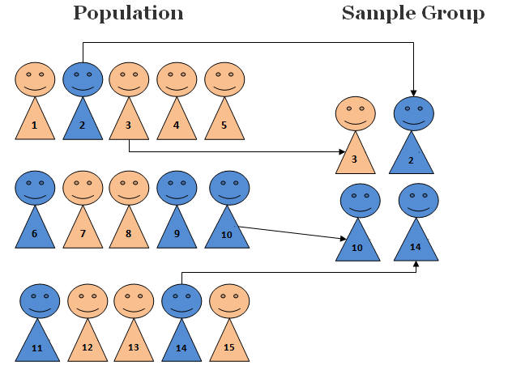
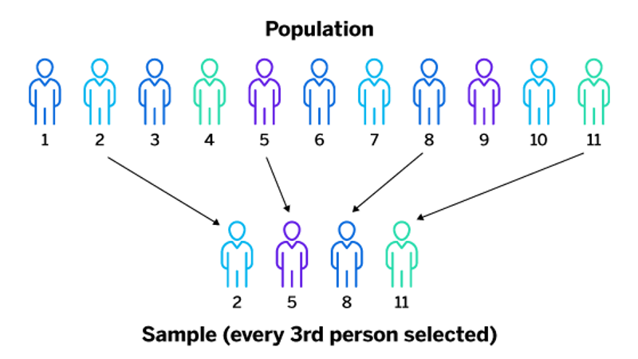
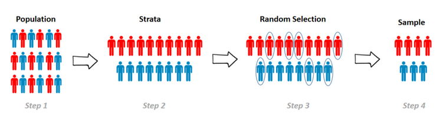
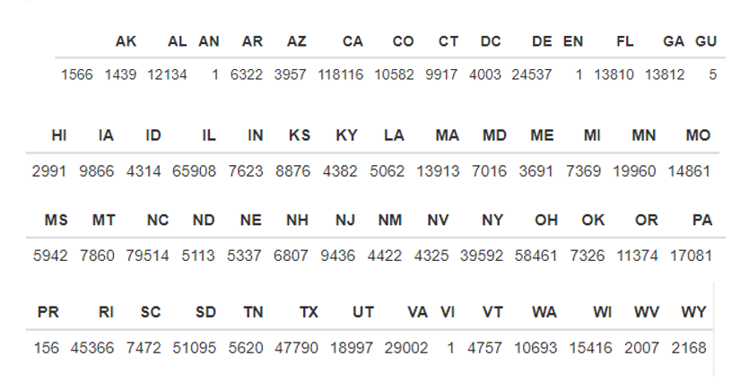

```{=html}
<style type="text/css">
h1.title {
  font-size: 20px;
  text-align: center;
}
h4.author { 
    font-size: 18px;
    text-align: center;
}
h4.date { 
  font-size: 18px;
  text-align: center;
}
h1 {
    font-size: 22px;
    text-align: center;
}
h2 {
    font-size: 18px;
    text-align: left;
}

div#TOC li {
    list-style:none;
}
</style>
```
```{r setup, include=FALSE}
# code chunk specifies whether the R code, warnings, and output 
# will be included in the output files.
if (!require("knitr")) {
   install.packages("knitr")
   library(knitr)
}

knitr::opts_chunk$set(echo = FALSE,       
                      warnings = FALSE,   
                      results = TRUE,   
                      message = FALSE,
                      fig.align='center', 
                      fig.pos = 'ht')
#knitr::opts_knit$set(root.dir = 'C:\\STA551\\wkdir0')
```

# Introduction

Analysis, We carry out an analysis by comparing the performance of three random sampling plans: simple random sampling (SRS), systematic sampling (SS), and stratified sampling based on a large bank load data set as the finite population.

The data set is from the U.S. Small Business Administration (SBA) and provides historical data from 1987 through 2014. This large data set contains 27 variables and 899,164 observations.at was guaranteed to some degree by the SBA. Detailed information about the data set can be found at 

The original data set was split into 9 subsets that are stored on GitHub. We need to load these data sets to R and create a single data set.

```{r}
loan01 = read.csv("https://pengdsci.github.io/datasets/w06-SBAnational01.csv", header = TRUE)[, -1]
loan02 = read.csv("https://pengdsci.github.io/datasets/w06-SBAnational02.csv", header = TRUE)[, -1]
loan03 = read.csv("https://pengdsci.github.io/datasets/w06-SBAnational03.csv", header = TRUE)[, -1]
loan04 = read.csv("https://pengdsci.github.io/datasets/w06-SBAnational04.csv", header = TRUE)[, -1]
loan05 = read.csv("https://pengdsci.github.io/datasets/w06-SBAnational05.csv", header = TRUE)[, -1]
loan06 = read.csv("https://pengdsci.github.io/datasets/w06-SBAnational06.csv", header = TRUE)[, -1]
loan07 = read.csv("https://pengdsci.github.io/datasets/w06-SBAnational07.csv", header = TRUE)[, -1]
loan08 = read.csv("https://pengdsci.github.io/datasets/w06-SBAnational08.csv", header = TRUE)[, -1]
loan09 = read.csv("https://pengdsci.github.io/datasets/w06-SBAnational09.csv", header = TRUE)[, -1]
bankLoan = rbind(loan01, loan02, loan03, loan04, loan05, loan06, loan07, loan08, loan09)
# dim(bankLoan)
#names(bankLoan)
```

# Three Sampling Plans- A Review

In this analysis, we will use three different sampling plans: simple random sampling (SRS), systematic sampling, and stratified sampling.

# Simple Random Sampling
A simple random sample takes a small, random portion of the entire population to represent the entire data set, where each member has an equal probability of being chosen.

```{r echo = FALSE, fig.align='center', out.width = '55%'}

```

# Systematic Sampling
Systematic sampling is a probability sampling method in which a random sample, with a fixed periodic interval (jump size), is selected from a larger population.
```{r echo = FALSE, fig.align='center', out.width = '55%'}

```

# Stratified Sampling
Stratified sampling involves the division of a population into smaller subgroups known as strata. In stratified, the strata are formed based on members’ shared attributes or characteristics, such as income or educational attainment. The shared attribute or characteristic is known as the stratification variable.

```{r echo = FALSE, fig.align='center', out.width = '55%'}

```

## Stratification Variable
For my stratification variable, I choose to use the term BankState.

```{r data-size}
bankstate =as.character(bankLoan$BankState)  # make a character vector
N=length(bankstate)                      # find the size of the data. 
f.table = -sort(-table(bankstate))       # sort the vector in descending order
n = length(f.table)                       # find the number of Bank States
n.0 = sum(f.table < 900)             # Bank States with less than 0.1% of the population size
# A note of the length of R variable name: the latest version of R has an upper bound 
# the maximum length of variable names from 256 characters to a whopping 10,000. 
# We should try our best to give meaningful names to R variables.
kable(cbind(Population.size = N, Number.of.Bank.States=n, Sub.Pop.less.900 = n.0))
```


Next, we explore the frequency distribution of the 2-digit BankState.

```{r}
bankstate.2.digits = substr(bankLoan$BankState, 1, 2)   # extract the last two digits of the BankState 
bankLoan$bankstate2Digit = bankstate.2.digits           # add the above two-digit variable the loan data
ftable = table(bankLoan$bankstate2Digit)
kable(t(ftable))
```

```{r echo = FALSE, fig.align='center', out.width = '65%'}

```

Here, I combine the bank states that are from HI to PA.

```{r}
cate.HI.PA = c("HI", "IA", "ID", "IL", "IN", "KS", "KY", "LA", "MA", "MD", "ME", "MI", "MN", "MO", "MS", "MT", "NC", "ND", "NE", "NH", "NJ", "NM", "NV", "NY", "OH", "OK", "OR", "PA")                      # combining bank states from HI to PA

bankstate2Digit0 = bankLoan$bankstate2Digit                   # extract the 2-digit Bank States
bankstate2Digit =  bankLoan$bankstate2Digit                   # extract the 2-digit Bank States-copy

logic.HI.PA = bankstate2Digit %in% cate.HI.PA          # identify the category: HI-PA
bankstate2Digit[logic.HI.PA] = 1643
bankLoan$strHIPA = bankstate2Digit
```


## Study Population

```{r}
del.categories = c("AN", "EN", "GU", "PR", "VI")       # categories to be deleted in 
                                                      # the original population
del.obs.status = !(bankLoan$strHIPA %in% del.categories) # deletion status. ! negation operator
study.pop = bankLoan[del.obs.status,]                     # excluding the categories
#kable(t(table(study.pop$strHIPA)))                   # Checking correctness operation
```

```{r echo = FALSE, fig.align='center', out.width = '95%'}
include_graphics("SamplingReport/studypopulation.png")
```

Note: 1643 is the combined states from HI to PA (HI being the 16th and PA being the 43rd in categories)

## Loan Default Rates by Bank States: Study Population

We now find the loan default rates by industry defined by the stratification variable strHIPA. The loan default status can be defined by the variable MIS_Status.

```{r}
x.table = table(study.pop$strHIPA, study.pop$MIS_Status)
no.lab = x.table[,1]      # first column consists of unknown default label
default = x.table[,2]
no.default = x.table[,3]
default.rate = round(100*default/(default+no.default),1)
default.status.rate = cbind(no.lab = no.lab, 
                          default = default, 
                          no.default = no.default,
                          default.rate=default.rate)
#kable(default.status.rate)
```

```{r echo = FALSE, fig.align='center', out.width = '75%'}
include_graphics("SamplingReport/picture3.png")
```

-   **Simple Random Sampling**

We simply take random IDs and then identify the records based on the sampled IDs to obtain the SRS sample.

```{r}
study.pop$sampling.frame = 1:length(study.pop$GrAppv)   # sampling list
# names(study.pop)                                      # checking the sampling list variable
sampled.list = sample(1:length(study.pop$GrAppv), 4000) # sampling the list
SRS.sample = study.pop[sampled.list,]                   # extract the sampling units (observations)
## dimension check
dimension.SRS = dim(SRS.sample)
names(dimension.SRS) = c("Size", "Var.count")
#kable(t(dimension.SRS))                                        # checking the sample size
```

-   **Systematic sampling**

```{r}
jump.size = dim(study.pop)[1]%/%4000   # find the jump size in the systematic sampling
# jump.size
rand.starting.pt=sample(1:jump.size,1) # find the random starting value
sampling.id = seq(rand.starting.pt, dim(study.pop)[1], jump.size)  # sampling IDs
#length(sampling.id)
sys.sample=study.pop[sampling.id,]    # extract the sampling units of systematic samples
sys.Sample.dim = dim(sys.sample)
names(sys.Sample.dim) = c("Size", "Var.count")
#kable(t(sys.Sample.dim))
```

The **jump size** is calculated by $m = 694216/4000 =173.55$. The actual jump size is 173. We use `sample()`random take a record from the first 173 records and then select every 173rd record to include in the systematic sample.

-   **Stratified Sampling**

We take an SRS from each stratum. The sample size should be approximately proportional to the size of the corresponding stratum. First, we calculate the SRS size for each stratum and then take the SRS from the corresponding stratum. Then take SRS samples from the corresponding subpopulations.

```{r}
freq.table = table(study.pop$strHIPA)  # frequency table of strHIPA
rel.freq = freq.table/sum(freq.table)   # relative frequency 
strata.size = round(rel.freq*4000)      # strata size allocation
strata.names=names(strata.size)         # extract strHIPA names for accuracy checking
```

```{r}
#kable(t(strata.size))  # make a nice-looking table using kable().
```

```{r}
strata.sample = study.pop[1,]    # create a reference data frame
strata.sample$add.id = 1         # add a temporary ID to because in the loop
# i =2                           # testing a single iteration
for (i in 1:length(strata.names)){
   ith.strata.names = strata.names[i]   # extract data frame names
   ith.strata.size = strata.size[i]     # allocated stratum size
   # The following code identifies observations to be selected
   ith.sampling.id = which(study.pop$strHIPA==ith.strata.names) 
   ith.strata = study.pop[ith.sampling.id,]  # i-th stratified population
   ith.strata$add.id = 1:dim(ith.strata)[1]  # add sampling list/frame
   # The following code generates a subset of random ID
   ith.sampling.id = sample(1:dim(ith.strata)[1], ith.strata.size) 
   ## Create a selection status -- pay attention to the operator: %in% 
   ith.sample =ith.strata[ith.strata$add.id %in%ith.sampling.id,]
   ## dim(ith.sample)         $ check the sample
   strata.sample = rbind(strata.sample, ith.sample)  # stack all data frame!
 }
 # dim(strata.sample)
 strat.sample.final = strata.sample[-1,]     # drop the temporary stratum ID
 #kable(head(strat.sample.final))                    # accuracy check!
```

# Performance Analysis of Random Samples

```{r captio="Population level default rates"}
x.table = table(study.pop$strHIPA, study.pop$MIS_Status)
no.lab = x.table[,1]   # first column consists of unknown default label
default = x.table[,2]
no.default = x.table[,3]
default.rate = round(100*default/(default+no.default),1)
 default.status.rate = cbind(no.lab = no.lab, 
                          default = default, 
                          no.default = no.default,
                          default.rate=default.rate)
#kable(default.status.rate, caption = "Population size, default counts, 
#                                      and population default rates")
```


```{r}
 # names(SRS.sample)
x.table = table(SRS.sample$strHIPA, SRS.sample$MIS_Status)
no.lab.srs = x.table[,1]      # first column consists of unknown default label
default.srs = x.table[,2]
no.default.srs = x.table[,3]
default.rate.srs = round(100*default.srs/(default.srs+no.default.srs),1)[-c(1,2,3)]
##
bankstate.code = names(default.rate.srs)  # extract BankState code
default.rate.pop = default.rate[bankstate.code]
# cbind(bankstate.code,bankstate.name)
SRS.pop.rates = cbind(default.rate.pop,default.rate.srs)
#rownames(SRS.pop.rates) = bankstate.name
#kable(SRS.pop.rates, caption="Comparison of Bank State-specific default rates 
#                               between population and the SRS.")
```


```{r}
x.table = table(sys.sample$strHIPA, sys.sample$MIS_Status)
no.lab.sys = x.table[,1]      # first column consists of unknown default label
default.sys = x.table[,2]
no.default.sys = x.table[,3]
default.rate.sys = round(100*default.sys/(default.sys+no.default.sys),1)[-c(1,2,3)]
sys.SRS.pop.rates = cbind(default.rate.pop, default.rate.srs, default.rate.sys)
#rownames(SRS.pop.rates) = bankstate.name
#kable(sys.SRS.pop.rates, caption="Comparison of Bank State-specific default rates 
#                               between population, SRS, and Systematic Sample.")
```

```{r}
#strat.sample.final
x.table = table(strat.sample.final$strHIPA, strat.sample.final$MIS_Status)
no.lab.str = x.table[,1]      # first column consists of unknown default label
default.str = x.table[,2]
no.default.str = x.table[,3]
default.rate.str = round(100*default.str/(default.str+no.default.str),1)[-c(1,2,3)]
str.SRS.pop.rates = cbind(default.rate.pop, default.rate.srs, default.rate.sys, default.rate.str)
str.SRS.pop.rates <- na.omit(str.SRS.pop.rates) 
#rownames(str.SRS.pop.rates) = bankstate.name[-1]
## after the table was created, I made an image to include in the document since it a random table
kable(str.SRS.pop.rates, caption="Comparison of Bank State-specific default rates 
                               between population, SRS, Systematic Sample, 
                               and Stratified Samples.")
```

```{r results = FALSE, fig.width=10, fig.height=4,  caption="Improved graphics"}
n=length(default.rate.pop)

plot(NULL, xlim=c(0,n), ylim=c(0, 50), 
     xlab="Bank State Classification Code", 
     ylab ="Default Rates (Percentage)", axes=FALSE) # empty plot
# Light gray background
rect(par("usr")[1], par("usr")[3],
     par("usr")[2], par("usr")[4],
     col = "white")

# Add white grid
grid(nx = NULL, ny = NULL,
     col = "white", lwd = 1)
title("Comparison of Bank State-specific Default Rates Based on Random Samples")
points(1:n, as.vector(default.rate.pop), pch=16, col="darkmagenta", cex = 0.8)
lines(1:n, as.vector(default.rate.pop),  lty=1, col="darkmagenta", cex = 0.8)
#
points(1:n, as.vector(default.rate.srs), pch=17, col="blue", cex = 0.8)
lines(1:n, as.vector(default.rate.srs), lty=1, col="blue", cex = 0.8)
#
points(1:n, as.vector(default.rate.sys), pch=19, col="orange3", cex = 0.8)
lines(1:n, as.vector(default.rate.sys), lty=1, col="orange3", cex = 0.8)
#
points(1:n, as.vector(default.rate.str), pch=20, col="darkgreen", cex = 0.8)
lines(1:n, as.vector(default.rate.str), lty=1, col="darkgreen", cex = 0.8)
#
axis(1,at=1:n, label=bankstate.code)
axis(2, las = 2)
#
clr = c("darkmagenta","blue","orange3","darkgreen")
rowMax=apply(str.SRS.pop.rates, 1, max) # max default rate in each Bank State
#segments(1:n, rep(0,n), 1:n, rowMax, lty=2, col="lightgray", lwd = 0.5)
legend(2, 45, c("Population", "Simple Random Sampling", "Systematic Sampling", "Stratified Sampling"), lty=rep(1,4), col=clr, pch=c(16,17,19,20), cex=0.6, bty="n")
```

```{r results = FALSE, fig.width=10, fig.height=4,  caption="MSE Comparison"}
## Plotting MSE of difference of default rates across industries
srs.diff = as.vector(default.rate.pop) - as.vector(default.rate.srs)
sys.diff = as.vector(default.rate.pop) - as.vector(default.rate.sys)
str.diff = as.vector(default.rate.pop) - as.vector(default.rate.str)
MSE = c(mean(srs.diff^2), mean(sys.diff^2), mean(str.diff^2))

plot(NULL, xlim=c(0,4), ylim=c(0,40), main="MSE of the difference of default rates", axes = FALSE, xlab="Sampling Plans", ylab="MSE")
axis(1, at=0:4, labels = c(" ", "SRS", "SYS", "STR", ""))
axis(2)
segments(c(1,2,3), c(0, 0, 0), c(1,2,3), MSE, lwd = 4, col = "navy")
```

# Conclusion
The MSE values are different for the three sampling plans each time we take sample.In order to make the approach more reliable it is better to take multiple samples and compare the mean of the MSEs.
